# Job Tracker

**Live demo:** https://applytrackr.app  
**Demo account:** `demo@jobtracker.dev` / `demo1234` — no sign-up needed

A full-stack kanban-based job search pipeline tracker built for senior/principal-level engineers managing a complex, multi-stage search.

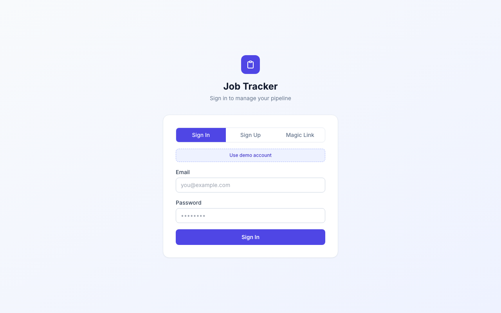

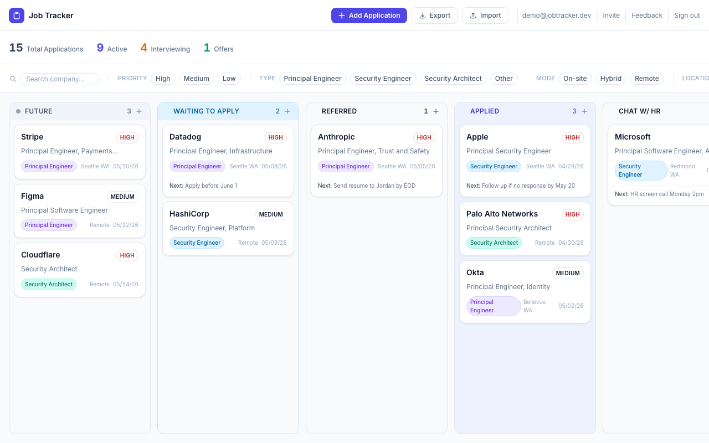

## What it does

Track every application through a nine-stage pipeline — from passive interest (`Future`) to final outcome (`Offer` / `Closed`) — on a drag-and-drop kanban board. Key capabilities:

- **Kanban board** with independently scrollable columns and real-time card counts
- **Full application record** — company, role, type, priority, location, work mode, source, referrer, notes, next step, and full job description storage
- **Drag to move & reorder** — move cards between stages or reorder within a column; order persists to the database
- **Filters & sort** — filter by priority, role type, work mode, and location simultaneously; sort by date, company, priority, or manual order
- **Stats bar** — at-a-glance totals: Total / Active / Interviewing / Offers
- **CSV export & import** — backup your data or bulk-import from a spreadsheet
- **Forgot password / change password** — reset via email or set a password if you signed up via magic link
- **Strong password enforcement** — minimum strength validated on the client and server
- **Invite a friend** — send a personalized invite email via Resend directly from the navbar
- **Branded auth emails** — all Supabase auth emails (magic link, signup, password reset) are re-sent via a Deno Edge Function through Resend with ApplyTrackr branding
- **Feature requests** — submit requests in-app via the Feedback button; owner approves with `status: approved` (triggering a Claude-generated design proposal), then finalises with `status: auto-implement` to implement and open a PR
- **Public roadmap** — `/roadmap` lists all open `user-requested` GitHub issues with status badges (Backlog / Planned / In Progress); recently closed items shown as shipped; revalidates hourly via ISR
- **Admin dashboard** — `/admin` shows total users, signups per day, applications per day, stage distribution, activation rate, and invite funnel (requires service-role key)
- **Auth** — email + password, magic link, or one-click demo account via Supabase Auth
- **Row Level Security** — every DB query is scoped to the authenticated user, enforced at the Postgres layer

> See [Development Journal](docs/development-journal.md) for the full story of how this project evolved — original intention, features added step by step, problems encountered and how they were solved, and the architecture decisions behind the production version.

---

## Architecture decisions

### Next.js 14 App Router
The App Router (RSC + Streaming) lets the dashboard server-render the initial board state with zero client-side loading flicker. Protected routes and session refresh live in a single `middleware.ts`, keeping auth logic out of every component. Server Components also allow the Supabase server client to run inside the request/response cycle without exposing credentials to the browser.

### Supabase over Firebase
| Concern | Supabase | Firebase |
|---|---|---|
| Data model | Relational (PostgreSQL) — a job application is naturally tabular | Document store — requires manual denormalization |
| Security | Row Level Security enforced at the DB layer | Firestore rules enforced at the SDK layer |
| Migrations | SQL files in version control | Schema changes are schema-less (both a feature and a hazard) |
| Auth | JWT-based, plugs into RLS `auth.uid()` | Separate auth, requires custom claims for Firestore rules |
| Open source | Self-hostable | Google-proprietary |

Job applications are structured, relational data (e.g., `ORDER BY` by date or priority, `WHERE status IN (...)` for funnel analytics). PostgreSQL is the right tool. Firebase shines for real-time collaborative documents, which isn't this app's core use case.

### @dnd-kit
`react-beautiful-dnd` was deprecated in 2023. `react-dnd` is powerful but has a large API surface. `@dnd-kit` is the modern standard: framework-agnostic sensors, accessible keyboard navigation out of the box, no third-party peer deps, and a collision-detection API that handles multi-container sorting cleanly.

The board uses `closestCorners` collision detection so a card snaps to the nearest column header _or_ card position — not just the center — which gives a tight, predictable drag target in narrow columns.

### Row Level Security (RLS)
RLS ensures that even if application code has a bug — a missing `WHERE user_id = X`, a misconfigured API route — the database simply returns nothing for rows that don't belong to the authenticated user. The policy:

```sql
create policy "Users can only access their own applications"
  on applications for all
  using (auth.uid() = user_id)
  with check (auth.uid() = user_id);
```

This is a defense-in-depth layer that costs nothing to add and eliminates an entire class of data-leakage bugs.

### Optimistic updates
Drag-and-drop operations update local React state immediately (via `handleDragOver` for cross-column moves and `handleDragEnd` for final order), then persist to Supabase in the background. The UI never waits for a round-trip, so drag feels instant even on a slow connection.

---

## Local development

### Prerequisites
- Node.js ≥ 18
- A Supabase project (free tier works)

### 1. Clone and install

```bash
git clone https://github.com/zhaoanliu/job-tracker.git
cd job-tracker
npm install
```

### 2. Configure environment

```bash
cp .env.local.example .env.local
```

Edit `.env.local`:

```env
NEXT_PUBLIC_SUPABASE_URL=https://<your-project>.supabase.co
NEXT_PUBLIC_SUPABASE_ANON_KEY=<your-anon-key>
```

Both values are in your Supabase project under **Settings → API**.

### 3. Apply the database migration

```bash
npx supabase login
npx supabase link --project-ref <your-project-ref>
npx supabase db push
```

In production, migrations are applied automatically by `cd.yml` on every push to `main` — no manual step needed after the initial setup.

### 4. Run the dev server

```bash
npm run dev
```

Open [http://localhost:3000](http://localhost:3000). You'll be redirected to `/login` — create an account and start tracking.

---

## Supabase setup checklist

1. Create a new project at [supabase.com](https://supabase.com)
2. Copy `Project URL` and `anon public` key from **Settings → API**
3. Run the migration (see above)
4. Verify RLS is enabled: in the **Table Editor**, confirm the shield icon on the `applications` table is active
5. (Optional) Enable Email confirmations under **Authentication → Providers → Email** — disable "Confirm email" for local dev convenience

---

## Testing

### Unit tests

```bash
npm test                 # run once
npm run test:watch       # watch mode
npm run test:coverage    # with coverage report
```

Uses Vitest + jsdom + Testing Library. Coverage thresholds enforced in CI (lines 85%, branches 80%, functions 65%).

### E2E tests — auth (runs in CI on every PR and push to main)

```bash
npm run test:e2e         # runs e2e/auth*.spec.ts against localhost:3000
```

Covers password login/logout, magic link sign-in, and signup email confirmation. Magic link and signup tests use [Testmail.app](https://testmail.app) to receive real emails and extract the confirmation link — they are automatically skipped if `TESTMAIL_API_KEY` is not set.

Required GitHub Actions secrets for `e2e.yml`:

| Secret | Where to find it |
|---|---|
| `NEXT_PUBLIC_SUPABASE_URL` | Supabase → Settings → API → Project URL |
| `NEXT_PUBLIC_SUPABASE_ANON_KEY` | Supabase → Settings → API → anon public key |
| `SUPABASE_SERVICE_ROLE_KEY` | Supabase → Settings → API → service_role key |
| `TESTMAIL_API_KEY` | Testmail.app dashboard |
| `TESTMAIL_NAMESPACE` | Testmail.app dashboard |
| `SUPABASE_ACCESS_TOKEN` | supabase.com → Account → Access Tokens (used by `cd.yml`; project ref derived from `NEXT_PUBLIC_SUPABASE_URL`) |

### E2E tests — board + CSV (async, never blocks PRs)

```bash
npx playwright test e2e/local/   # requires: supabase start
```

Covers the kanban board (add/edit/delete cards, stats bar, filter chips) and CSV import/export. Requires a running local Supabase instance (`supabase start`).

Runs automatically via `e2e-local.yml`:
- Nightly at 06:00 UTC
- On push to `main` when any of these paths change: `components/board/**`, `components/modals/**`, `components/ui/**`, `app/dashboard/**`, `lib/utils.ts`, `supabase/migrations/**`, `e2e/local/**`, `e2e/helpers.ts`
- Manually via `workflow_dispatch`

### Supabase redirect URL

Add these to **Supabase → Authentication → URL Configuration → Redirect URLs** to enable auth callback for magic link and signup confirmation:

```
https://your-app.vercel.app/**
http://localhost:3000/**
```

---

## Deployment to Vercel

```bash
npm i -g vercel
vercel
```

Or connect the GitHub repo in the Vercel dashboard and set environment variables:

| Variable | Value |
|---|---|
| `NEXT_PUBLIC_SUPABASE_URL` | Your Supabase project URL |
| `NEXT_PUBLIC_SUPABASE_ANON_KEY` | Your Supabase anon key |

Vercel auto-detects Next.js; no additional build configuration is needed.

After deploying, update the **Supabase Auth → URL Configuration** with your production URL:
- **Site URL**: `https://your-app.vercel.app`
- **Redirect URLs**: `https://your-app.vercel.app/**`

---

## CI / CD pipeline

All deployments are gated on four required CI checks passing. The pipeline is orchestrated by `cd.yml`.

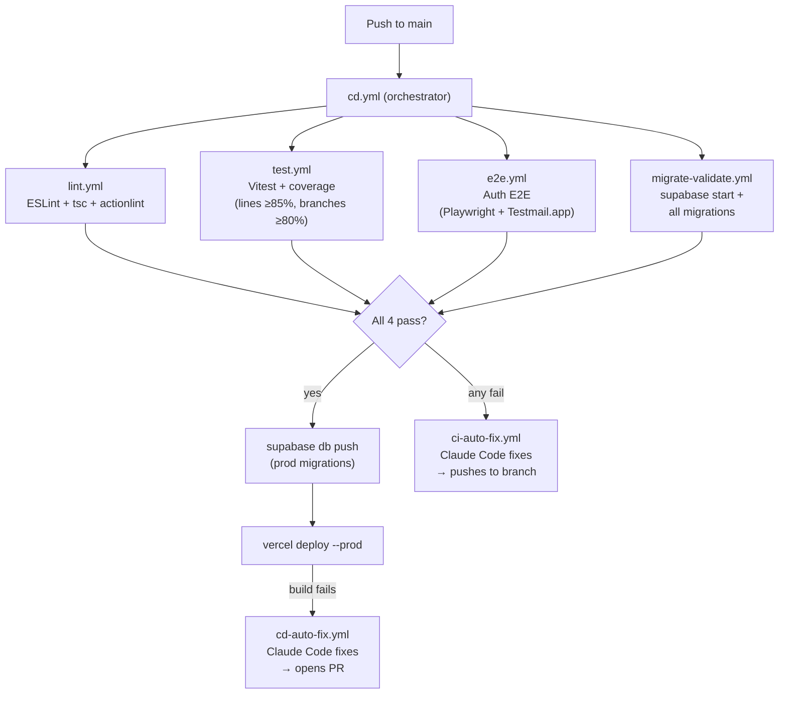

**Pull request flow:**

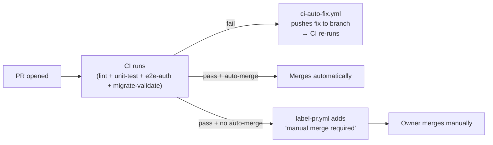

---

## Error monitoring & auto-fix pipeline

Eight self-healing and self-implementing workflows are powered by Claude Code. Every path ends in a PR — never a direct push to `main`.

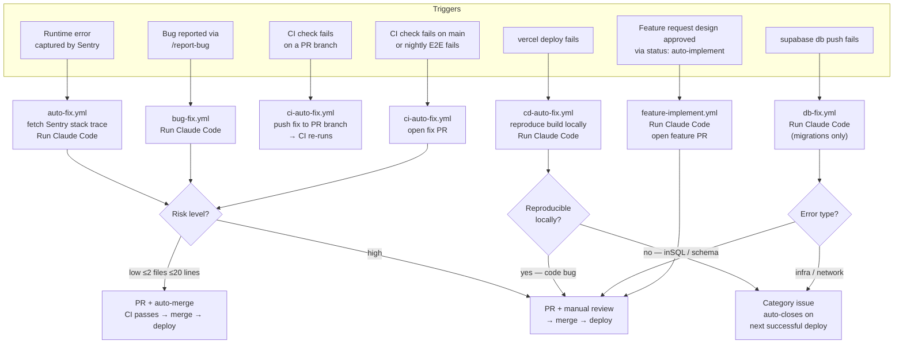

### Sentry → production runtime errors (`auto-fix.yml`)

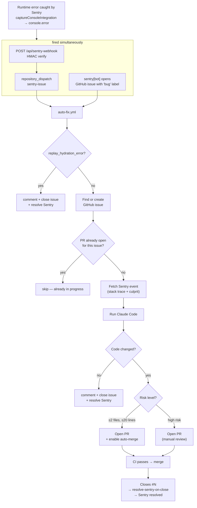

### Self-reported bugs (`bug-fix.yml`)

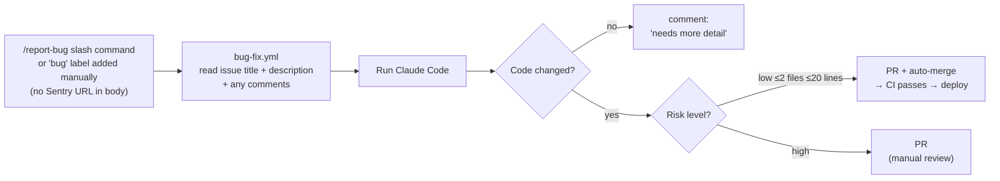

### CI failures → lint / type / test errors (`ci-auto-fix.yml`)

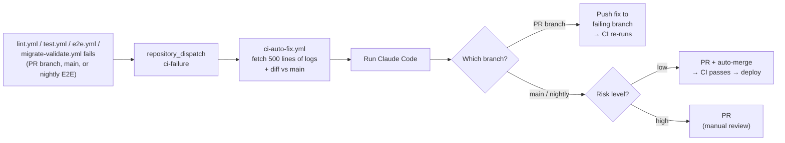

### User feature requests → design-then-implement (`feature-implement.yml`)

Two entry points feed the same two-phase pipeline:

- **User feedback** — user submits via the in-app Feedback button → `#X` created with `user-requested` label
- **Owner-planned** — owner runs `/plan-feature` → `#X` (roadmap issue, `planned` label) + `#Y` (implementation spec, `implementation` label) created together

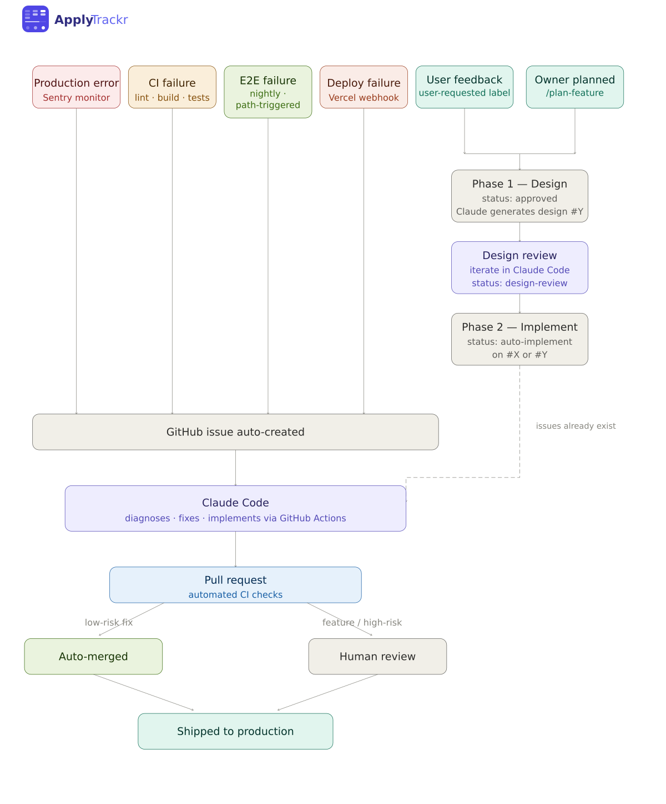

**Phase 1 — Design** (triggered by `status: approved` on `#X`):
- If `#Y` already exists (plan-feature path): links it, skips generation
- If no `#Y` yet (user feedback path): Claude reads the request and generates a structured design proposal as `#Y` with a `user review required` label
- `#X` moves to `status: design-review`; a comment on `#X` links to `#Y`
- Owner iterates on the design ad-hoc in a Claude Code session

**Phase 2 — Implement** (triggered by `status: auto-implement` on `#X` or `#Y`):
- Tagging either issue works — if `#Y` is tagged, the workflow detects the `implementation` label and finds `#X` via the back-reference in the body
- Both `#X` and `#Y` move to `status: in progress`
- Claude implements using both issues as context
- PR opened with `Closes #X` + `Closes #Y` — both issues close on merge

**Issue status flow:**

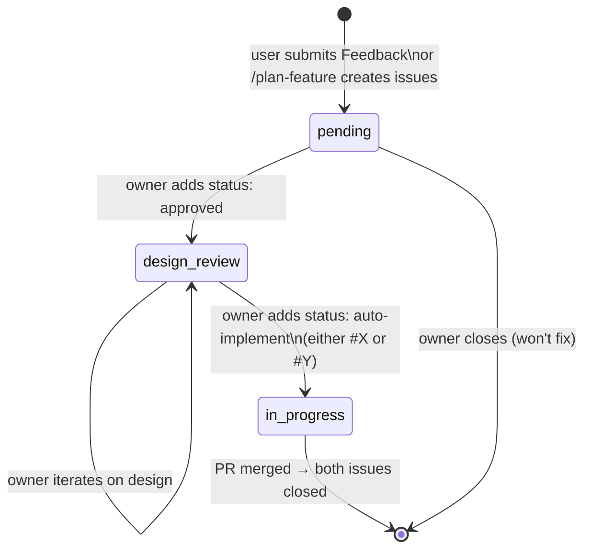

### CD failures → Vercel production build errors (`cd-auto-fix.yml`)

Two independent triggers fire when `vercel deploy --prod` fails: `cd.yml` dispatches directly (with the Vercel CLI error text), and `cd-filter.yml` triggers on Vercel's `deployment_status: failure` GitHub event. Both route to `cd-auto-fix.yml`.

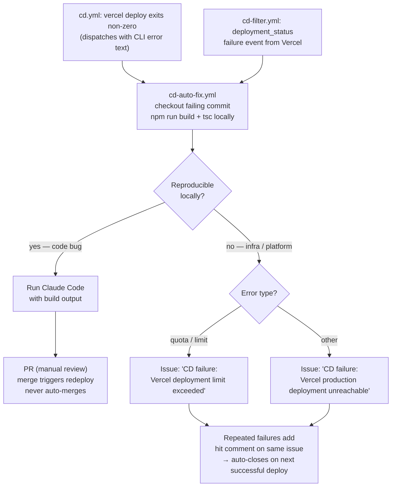

### DB migration failures (`db-fix.yml`)

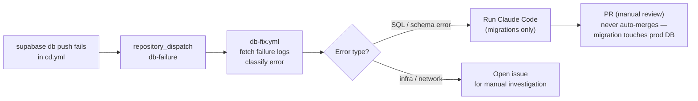

### Required secrets

**Vercel environment variables:**

| Variable | Value |
|---|---|
| `SENTRY_DSN` | Your Sentry project DSN (from Sentry → Settings → Projects → Client Keys) |
| `NEXT_PUBLIC_SENTRY_DSN` | Same DSN — the `NEXT_PUBLIC_` prefix makes it available in browser bundles |
| `SENTRY_ORG` | Your Sentry org slug (e.g. `zhaoans-org`) |
| `SENTRY_PROJECT` | Your Sentry **project slug** — check Sentry → Settings → Projects; it is auto-named and may differ from your repo name (wrong value silently breaks source map uploads) |
| `SENTRY_AUTH_TOKEN` | Sentry token with **`project:releases`** scope — used during the Vercel build to upload source maps; **different token** from the GitHub Actions one |
| `SENTRY_WEBHOOK_SECRET` | Secret you set when creating the Sentry webhook |
| `VERCEL_WEBHOOK_SECRET` | Secret you set when creating the Vercel webhook (see setup below) |
| `GH_PAT` | GitHub Personal Access Token with `repo` scope |
| `GITHUB_REPO` | `owner/repo` (e.g. `zhaoanliu/job-tracker`) |
| `RESEND_API_KEY` | Resend API key — used by `/api/invite` to send invite emails |
| `RESEND_FROM_EMAIL` | Sender address (e.g. `noreply@applytrackr.app`) — domain must be verified in Resend |

**GitHub Actions secrets** (Settings → Secrets and variables → Actions):

| Secret | Value |
|---|---|
| `ANTHROPIC_API_KEY` | Your Anthropic API key |
| `SENTRY_AUTH_TOKEN` | Sentry token with **Issue & Event: Read & Write** scope (used to fetch stack traces and resolve issues via the Sentry API) |
| `VERCEL_TOKEN` | Vercel token from Account Settings → Tokens (used by `cd.yml` to deploy) |

**GitHub repo settings** (required for auto-merge and branch protection):
- Actions → General → enable "Allow GitHub Actions to create and approve pull requests"
- General → enable "Allow auto-merge"
- Branches → Add branch protection rule for `main` → require status checks: `lint`, `unit-test`, `e2e-auth`, `migrate-validate`

### Sentry webhook setup

In Sentry: **Settings → Integrations → WebHooks**, add your Vercel URL:
```
https://your-app.vercel.app/api/sentry-webhook
```
Enable the **Issue** event type and copy the signing secret into `SENTRY_WEBHOOK_SECRET`.

### Vercel webhook setup

In the Vercel dashboard: **Settings → Webhooks**, add:
```
https://your-app.vercel.app/api/vercel-webhook
```
Select the **Deployment Failed** (`deployment.error`) event. Copy the signing secret into the `VERCEL_WEBHOOK_SECRET` Vercel environment variable so the API route can verify incoming requests.

---

## Pipeline stages

| ID | Label | Description |
|---|---|---|
| `future` | Future | Roles you want to track but haven't acted on |
| `watchlist` | Waiting to Apply | Actively watching; ready to apply soon |
| `referred` | Referred | Someone made an introduction |
| `applied` | Applied | Application submitted |
| `hr` | Chat w/ HR | Initial HR screen |
| `hm` | Chat w/ HM | Hiring manager conversation |
| `interview` | Interviewing | Active interview loop |
| `offer` | Offer | Offer received |
| `closed` | Closed | Withdrawn, rejected, or accepted |

---

## Claude Code slash commands

Four slash commands are available in Claude Code for common dev tasks:

| Command | What it does |
|---|---|
| `/open-issue` | Creates a GitHub issue with appropriate labels and a branch-ready title |
| `/implement` | Creates a GitHub issue, implements it on a branch, and opens a PR |
| `/ship` | Checks CI status on the current PR and merges if all checks pass |
| `/report-bug` | Creates a `bug`-labelled GitHub issue; the auto-fix bot picks it up and opens a PR |

Run any of them from Claude Code with `/open-issue`, `/implement`, `/ship`, or `/report-bug`.

---

## Phase 2 roadmap (scaffolded, not yet implemented)

See `TODO` comments in:

- `components/modals/ApplicationModal.tsx` — **Claude AI gap analysis**: paste JD and get a comparison against a stored resume using the Claude API
- `app/dashboard/page.tsx` — **Pipeline analytics**: funnel chart showing stage-by-stage conversion rates
- Chrome extension for auto-capturing job postings from LinkedIn / company career pages

---

## Project structure

```
├── app/
│   ├── layout.tsx            # Root HTML shell, Inter font, global CSS
│   ├── page.tsx              # Redirects → /dashboard
│   ├── auth/
│   │   ├── callback/         # Exchanges Supabase PKCE code for session (magic link / signup)
│   │   └── reset-password/   # Set/change password after clicking reset email link
│   ├── login/page.tsx        # Auth page (email/password + magic link + demo account)
│   ├── roadmap/page.tsx      # Public roadmap — GitHub issues with status badges (ISR hourly)
│   ├── admin/page.tsx        # Metrics dashboard (users, signups, stage distribution, invites)
│   ├── api/
│   │   ├── sentry-webhook/   # Validates HMAC, fires repository_dispatch to GitHub
│   │   ├── vercel-webhook/   # Validates Vercel webhook, fires cd-failure dispatch
│   │   ├── feature-request/  # Authenticated route: creates GitHub issue with user-requested label
│   │   ├── invite/           # Sends personalized invite email via Resend
│   │   └── events/           # Logs behavioural events (used by admin dashboard)
│   └── dashboard/
│       ├── layout.tsx
│       └── page.tsx          # Server Component: fetches initial data, passes to KanbanBoard
├── components/
│   ├── admin/
│   │   ├── MetricCard.tsx    # Single stat tile
│   │   ├── SignupsChart.tsx  # Signups per day (30-day bar chart)
│   │   ├── StageChart.tsx    # Stage distribution bar chart
│   │   └── EventsChart.tsx   # Behavioural events over time
│   ├── auth/AuthForm.tsx     # Client-side Supabase auth form (sign in/up/magic link/demo)
│   ├── board/
│   │   ├── KanbanBoard.tsx   # DndContext, state management, CRUD handlers
│   │   ├── KanbanColumn.tsx  # SortableContext + useDroppable per stage
│   │   ├── KanbanCard.tsx    # useSortable card, click-to-edit
│   │   └── DragOverlayCard.tsx
│   ├── modals/
│   │   └── ApplicationModal.tsx  # Add/edit form (tabbed: Details, Progress, JD)
│   └── ui/
│       ├── Badge.tsx         # Priority and type badges
│       ├── Navbar.tsx        # Top nav: add, export, import, invite, feedback, sign-out
│       ├── StatsBar.tsx      # Total / Active / Interviewing / Offers
│       └── FilterBar.tsx     # Multi-chip filters + sort selector
├── lib/
│   ├── supabase/
│   │   ├── client.ts         # Browser Supabase client (@supabase/ssr)
│   │   ├── server.ts         # Server Supabase client (cookies-based)
│   │   ├── service.ts        # Service-role client (admin dashboard only)
│   │   └── database.types.ts # Hand-written DB types (generate with supabase CLI)
│   ├── types.ts              # Application interface, Stage config, enums
│   ├── utils.ts              # Filter, sort, stats, formatting helpers
│   └── csv.ts                # CSV export/import (no library dependency)
├── __tests__/                # Vitest unit tests (mirrors src structure)
├── e2e/
│   ├── auth.spec.ts          # Password auth flows — CI on every PR/push
│   ├── auth.email.spec.ts    # Magic link + signup via Testmail.app — CI on every PR/push
│   ├── helpers.ts            # Shared test utilities (env-var-driven, local Supabase defaults)
│   └── local/                # Board + CSV tests — require supabase start, async cron only
├── .github/workflows/
│   ├── auto-fix.yml              # Auto-fix Sentry bugs with Claude Code
│   ├── bug-fix.yml               # Auto-fix manually-reported bugs (bug label, no Sentry URL)
│   ├── ci-auto-fix.yml           # Auto-fix CI failures (lint / E2E) with Claude Code
│   ├── cd-auto-fix.yml           # Auto-fix Vercel production build failures with Claude Code
│   ├── cd-filter.yml             # Filters deployment_status events → production failures only
│   ├── cd.yml                    # CD orchestrator: 4 CI checks → db push → vercel deploy
│   ├── db-fix.yml                # Auto-fix supabase db push failures with Claude Code
│   ├── feature-implement.yml     # Implement approved feature requests on status: auto-implement label
│   ├── label-pr.yml              # Adds 'manual merge required' when all CI passes, no auto-merge
│   ├── e2e.yml                   # Auth E2E on every PR/push (no local Supabase)
│   ├── e2e-local.yml             # Board + CSV E2E — nightly + path-triggered (supabase start)
│   ├── lint.yml                  # ESLint + tsc + actionlint on every PR
│   ├── migrate-validate.yml      # Validate all migrations against local Supabase stack
│   ├── test-composite-actions.yml  # Verifies composite actions work on every PR touching .github/actions/
│   └── test.yml                  # Vitest unit tests + coverage on every PR
├── .claude/commands/
│   ├── open-issue.md             # /open-issue slash command
│   ├── implement.md              # /implement slash command
│   ├── ship.md                   # /ship slash command
│   └── report-bug.md             # /report-bug slash command
├── supabase/
│   └── migrations/               # Timestamped SQL migration files
├── middleware.ts             # Session refresh + auth redirects
├── instrumentation.ts        # Sentry server/edge init (captureConsoleIntegration)
├── instrumentation-client.ts # Sentry browser init (captureConsoleIntegration + filters)
├── renovate.json             # Auto-updates pinned workflow tool versions
└── README.md
```

---

## License

MIT
