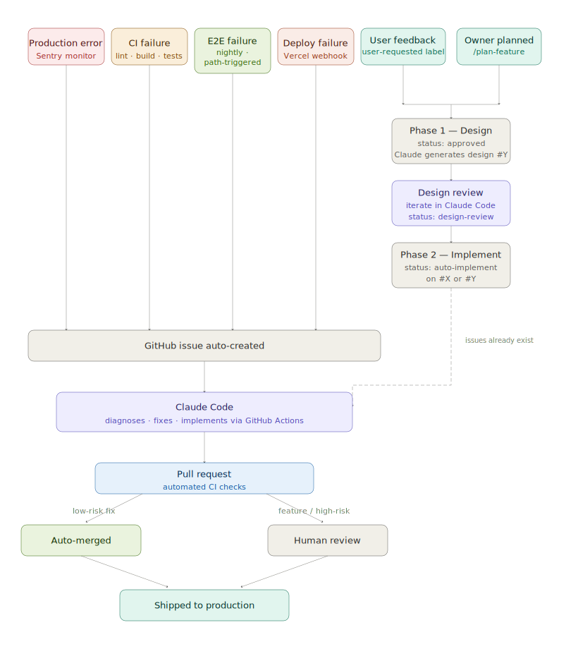

# Job Tracker — Development Journal

## Origin & Intention

This project started as a practical tool built inside a Claude.ai conversation. Zhaoan Liu, a principal-level software engineer actively job searching after a layoff, needed a way to track job applications across multiple companies, stages, and referral contacts. Rather than using a spreadsheet or a generic tool like Notion, the goal was to build something purpose-fit for a senior technical job search — with pipeline stages that reflect how hiring actually works at this level, and fields tailored to things that matter: referrers, JD storage, next steps, and priority.

The initial scope was simple: a kanban-style board that lives in the browser, requires no login, and just works.

---

## Feature Evolution (Step by Step)

### v1–v5 — Core kanban board
- Basic kanban board with pipeline stages
- Cards showing company, role, date, priority badge
- Click to open edit modal
- Add application button
- Filter by priority, role type, work mode

### v6–v10 — Data fields & polish
- Location dropdown (Bellevue WA, Seattle WA, Redmond WA, Remote)
- Work mode badge (On-site, Hybrid, Remote)
- Job link field with "Open ↗" button
- Referrer field displayed on card
- Source / how found field
- Notes and next step fields
- Rich text editor (RTE) for job description with bold, italic, underline, lists, headings

### v11–v15 — Export & import
- One-click "Copy CSV" button — copies full data to clipboard
- Import CSV — file picker with preview-before-confirm safety step
- RFC 4180-compliant CSV parser — handles quoted fields with embedded newlines (critical for JD field)
- All fields always quoted on export to prevent multiline corruption

### v16–v19 — Sort & filter improvements
- Sort dropdown: date, company A-Z, priority, manual order
- Location filter added to filter bar
- Location field changed from free text to dropdown

### v20–v22 — Pipeline refinement
- Added "Referred" stage (purple)
- Added "Chat w/ HM" stage (gold)
- Old "Phone screen" stage migrated to "Chat w/ HR"
- Full pipeline: Watchlist → Referred → Applied → Chat w/ HR → Chat w/ HM → Interviewing → Offer → Closed
- Source field changed from free text to dropdown: LinkedIn (default), Company website, Other

### v23–v27 — Drag and drop (major effort)
See dedicated section below.

### v28–v30 — Final stage additions
- Added "Future" stage (gray) — for companies with potential future openings
- Renamed "Watchlist" to "Waiting to Apply"
- Final pipeline: Future → Waiting to Apply → Referred → Applied → Chat w/ HR → Chat w/ HM → Interviewing → Offer → Closed
- "Future" set as default status for new entries
- Active count in stats excludes Future and Closed

---

## Problems Encountered & How They Were Solved

### Problem 1: CSV export blocked in sandbox
**What happened:** The first export implementation used `URL.createObjectURL` to trigger a file download. This is standard browser behavior, but Claude's widget sandbox blocks it entirely — clicking "Export CSV" did nothing.

**Attempts:**
- v1: `URL.createObjectURL` + `a.click()` — silently blocked
- v2: Showed the CSV in a panel with a copy button — worked but awkward UX
- v3 (final): One-click "Copy CSV" using `navigator.clipboard.writeText` with a fallback to `execCommand('copy')` — clean, no panel, works reliably in the sandbox

**Lesson:** The Claude widget sandbox has significant restrictions beyond a normal browser. File downloads, blob URLs, and `confirm()` dialogs are all blocked.

---

### Problem 2: CSV import breaking on multiline job descriptions
**What happened:** When a job description contained line breaks (which it almost always does), the line-by-line CSV parser treated each newline as a new row — turning 5 applications into 20.

**Root cause:** The original parser split on `\n` naively, not understanding that newlines inside quoted fields are valid CSV content per RFC 4180.

**Fix:** Rewrote the parser as a character-by-character state machine. It tracks whether the parser is inside a quoted field (`inQ` flag). Newlines inside quotes are treated as field content; newlines outside quotes end the row. Also changed the CSV builder to always quote every field, removing ambiguity entirely.

---

### Problem 3: HTML5 drag and drop API unreliable in sandbox
**What happened:** Multiple attempts to implement drag and drop using the browser's native HTML5 drag API (`draggable`, `dragstart`, `drop`, etc.) consistently failed — cards could not be moved between columns or reordered within a column.

**Attempts:**
- v23: HTML5 drag API — cross-column worked once, then stopped entirely
- v24: Fixed drag state persistence across re-renders — still broken for within-column
- v25: Complete rewrite using mouse events (`mousedown`, `mousemove`, `mouseup`) — cross-column worked, within-column did not
- v26: Added ghost card using pre-captured bounding rects — ghost card got stuck on screen when mouse left the iframe
- v26b: Added safety cleanup: `mouseleave`, `keydown`, `window.blur` cancel drag — ghost stuck issue resolved

**Root cause of within-column failure:** `elementFromPoint` during `mousemove` was hitting the flying ghost card instead of the real cards underneath, making position detection useless.

**Fix (v27):** Snapshot all card bounding rectangles at the exact moment drag starts, before the ghost card exists. All hit-testing during the drag uses those pre-captured rects, so the ghost is invisible to collision detection.

**Root cause of sort conflict:** Even after fixing position detection, within-column reorder wasn't sticking because the sort was set to "Date (newest first)" — so after every drop, cards re-sorted by date and ignored the new manual order.

**Fix:** Auto-switch to "Manual" sort the moment a drag begins. Snapshot the current visual order from whatever sort is active, assign those as `order` values, switch the sort dropdown to Manual, re-render, then proceed with the drag. Users never need to manually select Manual sort first.

---

### Problem 4: Ghost card permanently stuck on screen
**What happened:** If the user released the mouse button outside the widget iframe (e.g. scrolled away, clicked the Claude chat), the `mouseup` event never fired inside the widget. The flying ghost card remained on screen permanently, overlaid on other cards.

**Fix:** Three safety net listeners added — `document.mouseleave`, `document.keydown`, and `window.blur` — all call `cancelDrag()` which removes the ghost, clears all drag state, and re-renders the board.

---

## The Biggest Problem: Why We Moved to GitHub & Production

The single biggest limitation of the entire Claude widget approach is **data persistence tied to one browser on one machine**.

Everything in the tracker — every job entry, every note, every JD, every status update — lives in `localStorage`, which is:

- **Browser-specific:** Data in Claude in Chrome (the browser extension) is completely separate from Claude.ai in Safari or Firefox
- **Machine-specific:** No access from another computer or phone
- **Fragile:** Clearing browser data wipes everything
- **Not exportable easily:** The sandbox blocked file downloads entirely; we had to resort to clipboard-copy workarounds

This came to a head when Zhaoan opened the tracker in Claude.ai and found it showing only sample data — all real job entries were in a different browser context (Claude in Chrome). Two separate data islands with no way to sync.

**Additionally:**
- The Claude widget sandbox blocks standard web APIs (file downloads, blob URLs, `confirm()` dialogs)
- Drag and drop required multiple complete rewrites because of sandbox restrictions
- There is no way to share the tracker or access it from mobile

**The conclusion:** The tracker had outgrown the widget. To be genuinely useful during an active job search — accessible from any device, reliable, and shareable — it needed to be a real application with a real backend.

---

## Technology Choices for the GitHub Project

| Technology | Why chosen |
|---|---|
| **Next.js 14 (App Router)** | Industry standard for React full-stack apps; Vercel deployment is trivial; App Router enables server components and proper auth patterns |
| **TypeScript** | Type safety across the full data model; important for a portfolio piece demonstrating principal-level engineering standards |
| **Tailwind CSS** | Rapid, consistent styling without a heavy component library; matches the clean aesthetic of the Claude widget |
| **Supabase** | PostgreSQL under the hood (not a proprietary DB); built-in auth; Row Level Security means each user's data is isolated at the database level — no application-layer auth bugs can leak data between users. Also solves the encryption concern from the widget version. |
| **@dnd-kit** | The most reliable drag-and-drop library for React; avoids the HTML5 drag API entirely (which caused all our problems in the widget) |
| **Vercel** | Zero-config deployment for Next.js; auto-deploys on every GitHub push; free tier sufficient for a portfolio project |

---

## Architecture Highlights

**Row Level Security (RLS)** was a deliberate choice over application-layer access control. With RLS enabled on the `applications` table in Supabase, a database query from one user's session literally cannot return another user's rows — the database enforces it, not the application code. This is a security-first design that reflects the kind of thinking expected at the principal level.

**Optimistic updates for drag and drop** — the UI updates instantly on drop without waiting for the database write. If the write fails, it rolls back. This makes the app feel fast even on a slow connection.

**Phase 2 TODOs scaffolded** — Claude API JD analysis, pipeline funnel charts, and a Chrome extension are left as commented stubs in the codebase. This demonstrates planning ahead and makes the project roadmap visible to anyone reading the code.

---

## The Production Phase

Once the app was live at https://applytrackr.app, the goal shifted from "build features" to "operate reliably and keep improving." This section covers everything built after launch.

---

### Self-Healing Architecture

The production system grew into eight distinct self-healing and self-implementing scenarios. Every path ends in a PR gated on full CI — never a direct push to `main`.



**1. Production error → Sentry → auto-fix**

`console.error` → `captureConsoleIntegration` forwards to Sentry → two events fire simultaneously: `sentry[bot]` opens a GitHub issue (with `bug` label), and the Sentry webhook POSTs to `/api/sentry-webhook` (HMAC verified) → `repository_dispatch: sentry-issue` → `auto-fix.yml`:
- `replay_hydration_error`? → close issue + resolve Sentry (done)
- Otherwise: find or create GitHub issue, fetch full Sentry event (stack trace, culprit, error type), run Claude Code
- No changes → close issue + resolve Sentry (done)
- Changes → PR: **low-risk** (≤2 files, ≤20 lines): auto-merge after CI → `cd.yml` → redeploy + Sentry resolved. **High-risk**: `manual merge required`.

**2. Self-reported bug → bug-fix**

`/report-bug` slash command (or manually adding `bug` label to an issue without a Sentry URL in the body) → `bug-fix.yml`: Claude Code diagnoses from issue title, description, and comments → no changes: requests more detail. Changes → PR: **low-risk**: auto-merge after CI → deploy. **High-risk**: `manual merge required`.

**3. CI failure on a PR branch → patch and re-run**

`lint.yml` / `test.yml` / `e2e.yml` / `migrate-validate.yml` fails on a PR → fires `ci-failure` dispatch → `ci-auto-fix.yml`: find or create GitHub issue (`"CI failure: <workflow> on <branch>"`), fetch 500 lines of failed-step logs + diff vs main, run Claude Code → no changes: comment (issue stays open). Changes: push fix directly to the failing branch → CI re-runs automatically on the same PR → issue closed.

**4. CI failure on main → fix PR → redeploy**

Same CI workflows fail on push to `main` → `ci-failure` dispatch → `ci-auto-fix.yml` (main-branch path): find or create issue, run Claude Code → PR: **low-risk**: auto-merge after CI → `cd.yml` → redeploy. **High-risk**: `manual merge required`.

**5. Nightly E2E failure → fix PR → redeploy**

`e2e-local.yml` fails (nightly cron at 06:00 UTC, or path-triggered push to `main`) → fires `ci-failure` dispatch with `head_branch: main` → routes through the same main-branch path as scenario 4.

**6. Deployment failure → classify → fix or track**

When `vercel deploy --prod` fails, two independent events fire: `cd.yml` dispatches `cd-failure` directly (with the Vercel CLI error text); `cd-filter.yml` triggers on Vercel's `deployment_status: failure` GitHub event. Both route to `cd-auto-fix.yml`, which runs `npm run build + tsc --noEmit` locally:
- **Code bug (reproducible)**: commit-specific GitHub issue → Claude Code → PR with `manual merge required` (CD fixes never auto-merge — merging triggers a new production deploy) → merge → `cd.yml` → redeploy
- **Infra/platform (not reproducible)**: category-title issue (`"CD failure: Vercel deployment limit exceeded"` or `"CD failure: Vercel production deployment unreachable"`) — repeated failures add a hit comment on the same issue → auto-closes when next production deployment succeeds

**7. DB migration failure → fix or investigate**

`supabase db push` fails in `cd.yml` → `db-failure` dispatch → `db-fix.yml` → classify from logs:
- **SQL/schema error** (syntax, constraint, policy conflict): Claude Code fixes the migration file → PR with `manual merge required` (never auto-merges — migration touches production DB)
- **Infra/network/auth error**: opens GitHub issue for manual investigation, no code fix

**8. Feature request → implementation → review**

User submits in-app Feedback → `POST /api/feature-request` → GitHub issue with `user-requested` label only (no status label) → owner reviews and adds either `status: backlog` (track for later) or `status: auto-implement` (implement now) → `feature-implement.yml` triggers on `status: auto-implement`: comment "implementing…", run Claude Code → no changes: requests more detail. Changes → PR with `manual merge required` → merge → `cd.yml` → redeploy.

---

**Key design decision — always create a PR:** Early versions pushed fixes directly to `main`. This was fast but bypassed CI — the fix could break a test or introduce a lint error. The pipeline was redesigned so every auto-fix goes through a PR with full CI (lint + type-check + unit tests + E2E auth + migration validation) before merging. Low-risk fixes (≤2 files, ≤20 lines) get auto-merge enabled so they land automatically once CI passes. High-risk fixes wait for a human. CD and DB migration fixes are always manual review regardless of size — merging a CD fix triggers a new production deploy, and DB migration fixes touch the production database.

**Key design decision — inject the Sentry event:** The initial implementation only gave Claude the GitHub issue title (e.g. "TypeError: Cannot read properties of undefined"). Claude would exhaust its turn limit looking for the bug without the stack trace. The fix: fetch the full Sentry event (stack trace, culprit URL, error type) via the Sentry REST API and inject it directly into Claude's prompt. Time to fix dropped dramatically.

**Browser-extension noise filtering:** Sentry was firing on hydration errors caused by password managers injecting `data-1password-filled` attributes into the DOM. These have no stack frames inside `/_next/` because the mismatch originates outside app code. A `beforeSend` callback was added to `instrumentation-client.ts` to drop hydration errors with no app-code frames. Real hydration errors (which DO have `/_next/` frames) are still reported.

**`Failed to fetch` transient errors** — caused by offline state, ad blockers, and page unloads — were added to the `ignoreErrors` list so they don't trigger the auto-fix bot on every user who has a brief network hiccup.

---

### CI/CD Redesign

The original setup auto-deployed to Vercel on every push to `main`. This meant a typo or a broken migration could go to production instantly.

**The redesigned pipeline:**

```
Push to main
    │
    ▼
cd.yml orchestrates all checks in parallel:
    │
    ├── lint.yml (ESLint + tsc + actionlint)
    ├── test.yml (Vitest + coverage thresholds)
    ├── e2e.yml (auth E2E via Playwright + Testmail.app)
    └── migrate-validate.yml (supabase start + all migrations)
    │
    ▼
All 4 pass?
    │
    ├─ supabase db push (production)  ← migrations land first
    │
    └─ vercel deploy --prod           ← new code served after
```

This guarantees the migration is in the database before the code that depends on it is live — closing the race condition that caused the `status_history` incident (table deployed days after the code needed it, with silent failures because `PostgrestError` objects logged as `[object Object]`).

**Vercel's `ignoreCommand` exit code semantics are inverted from Unix convention:** `exit 0` means "skip this build", `exit 1` means "proceed". `vercel.json` sets `ignoreCommand: exit 0` to disable Vercel's auto-deploy entirely. `cd.yml` owns all deployments.

**Version pinning:** Every tool version in every workflow is pinned exactly — Supabase CLI at `2.100.1`, `@anthropic-ai/claude-code` at `2.1.145`. Using `latest` makes a GitHub API call per run and fails with rate-limit errors on busy runners. A Renovate config was added to open PRs automatically when new versions are available.

---

### GitHub Actions Pitfalls (Learned the Hard Way)

Running workflows 100+ times surfaced a long list of non-obvious GitHub Actions behaviors:

**`if:` expressions must be a single line.** Using `|` (block scalar) adds a trailing newline that the expression parser silently rejects. The job is skipped with no error message — one of the hardest bugs to diagnose.

**Blank lines inside `run: |` blocks terminate the block scalar** if the line that follows starts at column 0. Use `echo ""` for blank lines in shell output.

**`gh issue list --search` has non-deterministic lag on new issues.** The full-text search index takes seconds to minutes to index a freshly-created issue. Using the list REST API (`gh issue list --state open --limit 50 --json number,title`) returns current data immediately. Filter with `jq` locally.

**The second queued auto-fix run fails to push** if the first already committed. After making the fix, the workflow must `git fetch origin main && git rebase origin/main`, then check if `COMMITS_AHEAD` is 0 — if so, the fix was already applied and the push is skipped.

**`GITHUB_TOKEN` pushes block `on: issues: closed` triggers.** When the bot merges a PR via `GITHUB_TOKEN`, GitHub closes the linked issue but suppresses the `issues: closed` workflow trigger. Fix: use `GH_PAT` (the repo owner's personal token) for auto-merge so the merge is attributed to a human actor, which GitHub does not suppress.

**`gh issue create` does not support `--json`.** Capture the URL it prints to stdout and extract the number with `grep -oE '[0-9]+$'`.

**`actions/github-script@v9` made `github-token` a required input with no default.** An empty `GH_PAT` secret causes "Input required and not supplied" and silently drops the `repository_dispatch`. Replaced with `gh api` + `jq -n ... | gh api repos/.../dispatches --method POST --input -` — more explicit and version-stable.

---

### The Label-Based Feature Request Flow

The original feature-implement workflow triggered on "self-assign" (`issues: assigned`). This was fragile — GitHub's event only fires when you assign someone *else*, not yourself via the UI's "Assign yourself" shortcut. It was replaced with a label-based flow that's explicit and visible.

**Current flow:**

```
User submits Feedback in navbar
    │ POST /api/feature-request → creates GitHub issue
    ▼
Issue: 'user-requested' + 'status: backlog'
    │
    │ Owner reviews the request
    ▼
Owner adds 'status: auto-implement' label
    │
    ▼
feature-implement.yml triggers
    │
    ├─ Comment: "Claude Code is implementing this…"
    ├─ Swap label: 'status: backlog' → 'status: in progress'
    ├─ Run Claude Code (implements the feature)
    │
    ├─ No changes? → comment "needs more detail"
    │
    └─ Changes made → open PR
            │
            ▼
        Owner reviews and merges
            │
            ▼
        Issue closes → roadmap shows as "Shipped"
```

**Issue status states:**

| Label | Meaning | Who sets it |
|---|---|---|
| `status: backlog` | Tracking for later — not ready to implement | Owner (optional) |
| `status: auto-implement` | Approved — triggers Claude Code to implement | Owner |
| `status: in progress` | Claude Code is working on it | Workflow |
| *(closed)* | Shipped or rejected | PR merge or owner |

The `/roadmap` page reads these labels live from the GitHub API (with 1-hour ISR) and shows a badge for each state.

---

### The `label-pr.yml` Workflow

Auto-fix PRs get auto-merge enabled so CI can land them without human interaction. Human-authored PRs don't have auto-merge — and it's easy to forget they're ready to merge after CI goes green.

`label-pr.yml` solves this by watching for all four required CI checks to pass on a PR, then adding a `manual merge required` label if auto-merge is not enabled. The label is removed automatically when a new commit is pushed (so it resets when the author makes changes). This creates a visible signal: if a PR has this label, it's ready to merge right now.

---

### New Features Added Post-Launch

**Forgot password / change password** — the original auth form only supported magic link and email/password. Users who signed up via magic link had no way to set a password. Added: a "Forgot password?" link on the sign-in tab that sends a Supabase password reset email, and a `/auth/reset-password` page where the link lands to complete the reset. Magic link users can also use this flow to set a password for the first time.

**Strong password requirements** — minimum length, character variety, and strength score validated client-side (with a visual meter) and enforced server-side. Prevents weak passwords like "password123" from being accepted.

**Invite-a-friend** — an "Invite" button in the navbar opens a modal where the user can enter a friend's name and email. Sends a personalized HTML email via Resend with Zhaoan's personal introduction and a link to the app. The invite is recorded in a Supabase `invites` table for the admin dashboard funnel.

**Demo account** — a "Use demo account" button on the login page fills in `demo@jobtracker.dev` / `demo1234` automatically. Eliminates the friction for anyone trying the app — no sign-up required. The demo account's data is seeded with realistic job applications across all pipeline stages.

**Public roadmap** — `/roadmap` fetches open `user-requested` GitHub issues and renders them with status badges (Backlog / Planned / In Progress). Recently closed issues appear as "Shipped". No login required. Implemented with ISR (`revalidate: 3600`) so it stays current without re-fetching on every page load.

**Admin metrics dashboard** — `/admin` requires the `SUPABASE_SERVICE_ROLE_KEY` to access auth admin APIs. Shows: total users, signups per day (30-day bar chart), total applications, applications per day, stage distribution, activation rate (users who created ≥1 application), and invite funnel (total invites sent, unique inviters). Not linked from the app UI — accessed directly.

**Branded auth emails** — all Supabase auth emails (magic link, signup confirmation, password reset) were being sent in plain Supabase branding. Added a Deno Edge Function (`supabase/functions/send-auth-email/`) configured as `hook_send_email` in the Supabase auth config. It re-delivers every auth email via Resend with ApplyTrackr branding (logo, colors, custom copy). Key gotcha: the hook payload provides `email_data.token_hash` and `email_data.site_url` — the confirmation URL must be built manually as `${site_url}/verify?token=${token_hash}&type=${type}`.

**Date field defaults to today** — previously the application date field was empty when creating a new entry, requiring a manual selection every time. Changed to default to the current date when the modal opens for a new application.

**Claude Code slash commands** — four commands added to `.claude/commands/`:
- `/open-issue` — creates a GitHub issue with the right labels and title format
- `/implement` — creates an issue, implements it on a branch, opens a PR
- `/ship` — checks CI status on the current PR and merges if all checks pass
- `/report-bug` — creates a `bug`-labelled GitHub issue; the auto-fix bot (`bug-fix.yml`) picks it up automatically and opens a PR without touching the current session

---

### Supabase `PostgrestError` Logging Incident

Supabase returns structured `PostgrestError` objects when a query fails. A bare `console.error(error)` logs the object as `[object Object]` — completely useless in Sentry. The fix was to always log `error.message` alongside the raw object: `console.error('context:', error.message, error)`.

The `status_history` incident exposed this: a new table was referenced in application code before the migration had been applied in production. The queries silently returned empty results (RLS returned nothing for a table that didn't exist), and Sentry showed `[object Object]` in the logs. It took hours to diagnose what would have been a 2-second fix if the error message had been logged.

Two lessons documented in CLAUDE.md:
1. Always log `error.message` alongside the raw error object in every Supabase error handler
2. Follow the DB schema checklist (migration → RLS → types → code → merge) without skipping steps

---

### CD Failure Issue Deduplication

A burst of five rapid merges overnight each hit Vercel's deployment limit. Because `cd-auto-fix.yml` used the commit SHA in the issue title (`"CD failure: Production deployment of <sha> failed"`), five separate issues were created for the same root cause. The deduplication logic — which matches on title — never fired because every SHA is unique.

Two separate problems:

1. **SHA-specific titles prevent deduplication across commits for infra failures.** A Vercel deployment limit, network hiccup, or platform outage is a *category* problem, not a per-commit code bug. Code bugs legitimately need per-SHA issues (each commit is a different change). Infra failures do not.

2. **No auto-close on recovery.** When subsequent deploys succeeded, the stale issues stayed open indefinitely.

The fix introduces a distinction between the two failure types:

- **Infra/platform failure** (`reproducible=false`): uses a stable category title — `"CD failure: Vercel deployment limit exceeded"` or `"CD failure: Vercel production deployment unreachable"` — so all failures of the same type land on one issue. Repeated hits add a comment (`Another deployment failure — commit \`abc1234\``) rather than opening duplicates. The Vercel CLI output (last 30 lines) is now passed in the dispatch payload as `vercel_error` so the workflow can classify the error type.

- **Code bug** (`reproducible=true`): behavior unchanged — SHA-specific title, Claude runs, PR opened. These are genuinely distinct per commit.

`cd.yml` now also closes all open `CD failure:` issues automatically when a production deploy succeeds, commenting with the commit SHA that resolved the situation.

---

### Feature Implementation: Design-Then-Implement Pipeline

The original `feature-implement.yml` had a critical flaw exposed by the dark mode incident: when a user submitted "support dark mode" via the Feedback button and the owner approved it, Claude created a `ThemeProvider` component with full context, localStorage persistence, and system preference detection — and stopped there. The component was never wired into `app/layout.tsx`, no toggle appeared in the Navbar, no `dark:` Tailwind classes were applied anywhere. Tests passed because they only tested `ThemeProvider` in isolation. CI was green. The PR merged. The feature was invisible to users.

The root cause: Claude implemented what it could verify locally (a self-contained component + unit tests) and had no spec requiring user-visible integration. There was no design review step, no acceptance criteria, no check that "user can click something to toggle dark mode."

The fix splits `feature-implement.yml` into two phases:

**Phase 1 — Design** (triggered by `status: approved`): Claude reads the feature request and generates a structured design proposal as a new GitHub issue with a `user review required` label. The proposal must include: what the user actually wants, which files to modify, where exactly in the UI the change appears, and a checklist of acceptance criteria with at least one user-visible action. For `/plan-feature` issues that already have an implementation spec, Phase 1 detects the existing spec and links it instead of generating a new one.

**Phase 2 — Implement** (triggered by `status: auto-implement`): Claude reads both the original request and the approved design spec and implements accordingly. The PR closes both the feature issue and the design issue on merge.

Two additional design decisions worth noting:

**Bidirectional trigger**: `status: auto-implement` can be added to either the feature issue or the design issue — whichever is open in front of you at the time. The workflow detects which is which via labels (`implementation` label = design issue) and body back-references (`See user-facing issue: #N`, `Design for feature request #N`), swaps focus if needed, and always ends up targeting the feature issue with the design issue as context.

**`/plan-feature` alignment**: `/plan-feature` already creates a two-issue pair (roadmap issue + implementation spec) — the same structure Phase 1 produces. The two flows are now fully aligned: both converge on `status: auto-implement` → Phase 2, with the only difference being the origin label (`user-requested` vs `planned`) and whether the design issue is AI-generated or human-written.

---

## What This Project Demonstrates

For a principal-level engineering portfolio, this project shows:

- **Full-stack ownership** — from data model to UI to deployment to operations
- **Security thinking** — RLS, auth, per-user data isolation, HMAC webhook verification
- **Iterative problem solving** — drag and drop went through 5+ rewrites to get right; the auto-fix pipeline went through a dozen iterations to handle concurrency, deduplication, and noise filtering correctly
- **Product sense** — the pipeline stages, field choices, UX decisions, and feature prioritization reflect real job search experience
- **AI integration in production** — Claude Code is embedded in the CI/CD pipeline as an active operator, not just a dev tool; the auto-fix, CI-auto-fix, CD-auto-fix, and feature-implement workflows all use it to reduce manual toil
- **Operational maturity** — Sentry for error monitoring, auto-healing pipelines, version pinning via Renovate, CI coverage thresholds, actionlint for workflow validation
- **Documentation** — thorough README and CLAUDE.md explaining architecture decisions and operational gotchas, not just setup steps
